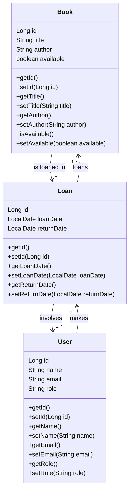

## Introduction

This is an API made in Java using Spring Web concepts with the function of serving as a library management system.

Through this system, it is possible to control the entries and exits of books and users, in addition to managing and improving the loan system, ensuring more effective, dynamic and simplified management.

[Swagger UI](https://sjb-2024-prd.up.railway.app/swagger-ui/index.html#/)
[Postman Collection (In case of Swagger UI issues)](https://www.postman.com/aerospace-administrator-89005134/workspace/santander-library-management-system-api/collection/37283600-953cbb31-3989-45e5-ba17-5fd240ca7572?action=share&creator=37283600)

## Classes Diagram

