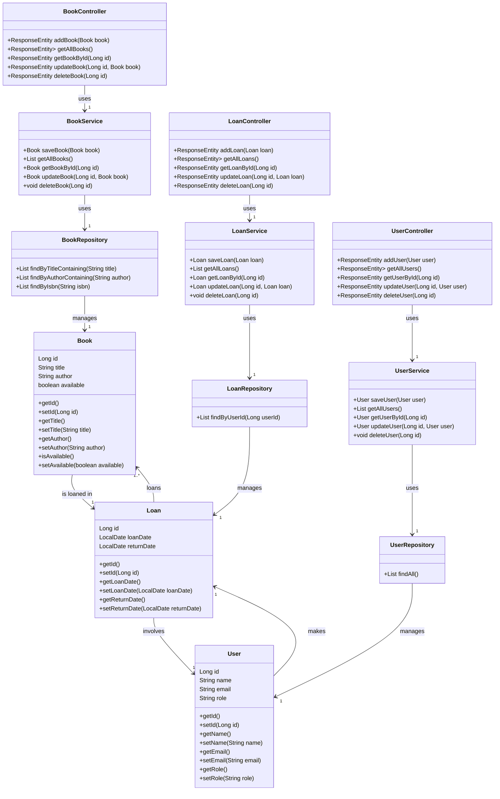

#Diagrama de Classes

```mermaid

classDiagram
  class Book {
    Long id
    String title
    String author
    boolean available
    +getId()
    +setId(Long id)
    +getTitle()
    +setTitle(String title)
    +getAuthor()
    +setAuthor(String author)
    +isAvailable()
    +setAvailable(boolean available)
  }

  class User {
    Long id
    String name
    String email
    String role
    +getId()
    +setId(Long id)
    +getName()
    +setName(String name)
    +getEmail()
    +setEmail(String email)
    +getRole()
    +setRole(String role)
  }

  class Loan {
    Long id
    LocalDate loanDate
    LocalDate returnDate
    +getId()
    +setId(Long id)
    +getLoanDate()
    +setLoanDate(LocalDate loanDate)
    +getReturnDate()
    +setReturnDate(LocalDate returnDate)
  }

  Book --> "1" Loan : is loaned in
  User --> "1" Loan : makes
  Loan --> "1..*" Book : loans
  Loan --> "1..*" User : involves

  class BookRepository {
    +List<Book> findByTitleContaining(String title)
    +List<Book> findByAuthorContaining(String author)
    +List<Book> findByIsbn(String isbn)
  }

  class UserRepository {
    +List<User> findAll()
  }

  class LoanRepository {
    +List<Loan> findByUserId(Long userId)
  }

  BookRepository --> "1" Book : manages
  UserRepository --> "1" User : manages
  LoanRepository --> "1" Loan : manages

  class BookService {
    +Book saveBook(Book book)
    +List<Book> getAllBooks()
    +Book getBookById(Long id)
    +Book updateBook(Long id, Book book)
    +void deleteBook(Long id)
  }

  class UserService {
    +User saveUser(User user)
    +List<User> getAllUsers()
    +User getUserById(Long id)
    +User updateUser(Long id, User user)
    +void deleteUser(Long id)
  }

  class LoanService {
    +Loan saveLoan(Loan loan)
    +List<Loan> getAllLoans()
    +Loan getLoanById(Long id)
    +Loan updateLoan(Long id, Loan loan)
    +void deleteLoan(Long id)
  }

  BookService --> "1" BookRepository : uses
  UserService --> "1" UserRepository : uses
  LoanService --> "1" LoanRepository : uses

  class BookController {
    +ResponseEntity<Book> addBook(Book book)
    +ResponseEntity<List<Book>> getAllBooks()
    +ResponseEntity<Book> getBookById(Long id)
    +ResponseEntity<Book> updateBook(Long id, Book book)
    +ResponseEntity<Void> deleteBook(Long id)
  }

  class UserController {
    +ResponseEntity<User> addUser(User user)
    +ResponseEntity<List<User>> getAllUsers()
    +ResponseEntity<User> getUserById(Long id)
    +ResponseEntity<User> updateUser(Long id, User user)
    +ResponseEntity<Void> deleteUser(Long id)
  }

  class LoanController {
    +ResponseEntity<Loan> addLoan(Loan loan)
    +ResponseEntity<List<Loan>> getAllLoans()
    +ResponseEntity<Loan> getLoanById(Long id)
    +ResponseEntity<Loan> updateLoan(Long id, Loan loan)
    +ResponseEntity<Void> deleteLoan(Long id)
  }

  BookController --> "1" BookService : uses
  UserController --> "1" UserService : uses
  LoanController --> "1" LoanService : uses
```