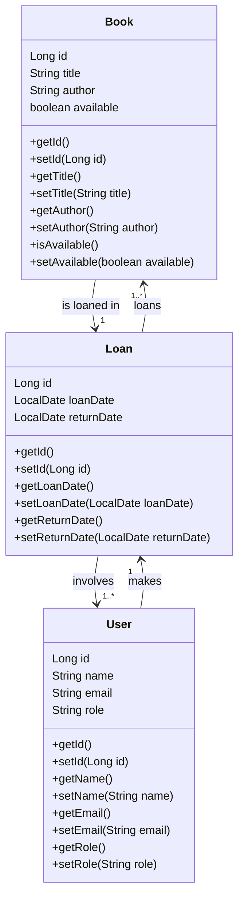

#Diagrama de Classes

```mermaid

classDiagram
  class Book {
    Long id
    String title
    String author
    boolean available
    +getId()
    +setId(Long id)
    +getTitle()
    +setTitle(String title)
    +getAuthor()
    +setAuthor(String author)
    +isAvailable()
    +setAvailable(boolean available)
  }

  class User {
    Long id
    String name
    String email
    String role
    +getId()
    +setId(Long id)
    +getName()
    +setName(String name)
    +getEmail()
    +setEmail(String email)
    +getRole()
    +setRole(String role)
  }

  class Loan {
    Long id
    LocalDate loanDate
    LocalDate returnDate
    +getId()
    +setId(Long id)
    +getLoanDate()
    +setLoanDate(LocalDate loanDate)
    +getReturnDate()
    +setReturnDate(LocalDate returnDate)
  }

  Book --> "1" Loan : is loaned in
  User --> "1" Loan : makes
  Loan --> "1..*" Book : loans
  Loan --> "1..*" User : involves


```